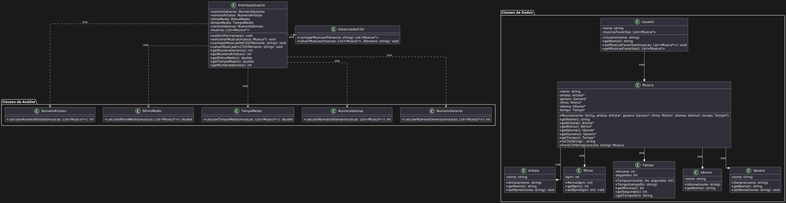

# The Creator - Sistema de Análise de Consumo Musical

## Descrição

"The Creator" é um sistema de análise de consumo musical desenvolvido em C++ que permite aos usuários inserir suas músicas favoritas e analisar dados como o número de gêneros, artistas e idiomas distintos, além do ritmo e tempo médio das músicas. O sistema interage com o usuário via terminal, solicitando informações sobre as músicas e exibindo os resultados. Este projeto demonstra conceitos de programação orientada a objetos e interação com o usuário.

## Diagrama UML

O diagrama UML do sistema está disponível no arquivo `_UML_diagrama_.png`. Ele mostra as seguintes classes principais:

*   **`Usuario`**: Representa um usuário do sistema, com um nome e uma lista de músicas favoritas.
*   **`Musica`**: Representa uma música, com atributos como nome, artista, gênero, ritmo (BPM), idioma e tempo.
*   **`Artista`**: Representa o artista da música.
*   **`Ritmo`**: Representa o ritmo da música em BPM.
*    **`Tempo`**: Representa o tempo de duração da música.
*   **`Idioma`**: Representa o idioma da música.
*   **`Genero`**: Representa o gênero da música.
*   **`NumeroArtistas`**: Classe responsável por calcular o número de artistas diferentes.
*   **`RitmoMedio`**: Classe responsável por calcular o ritmo médio das músicas.
*   **`TempoMedio`**: Classe responsável por calcular o tempo médio das músicas.
*   **`NumeroIdiomas`**: Classe responsável por calcular o número de idiomas diferentes.
*   **`NumeroGeneros`**: Classe responsável por calcular o número de gêneros diferentes.
*   **`InterfaceUsuario`**: Classe responsável pela interação com o usuário (exibição de menus, leitura de dados).

O diagrama também mostra as relações entre as classes, indicando como elas se associam e colaboram para realizar as funcionalidades do sistema.



## Como Executar o Sistema

Para executar o sistema "The Creator" no terminal, siga os passos abaixo:

### 1. Pré-requisitos

*   **Compilador C++:** Certifique-se de ter um compilador C++ instalado (como g++ ou clang++).
*   **Sistema Operacional:** O sistema foi desenvolvido e testado em ambientes Linux e Windows, mas deve funcionar em outros sistemas Unix.

### 2. Compilação

1.  Abra o terminal.
2.  Navegue até a pasta raiz do projeto.
3.  Compile o código usando o seguinte comando:
    ```bash
    g++ *.cpp -o main
    ```
    Este comando irá compilar todos os arquivos `.cpp` do diretório atual e gerar um executável chamado `main`.

### 3. Execução

1.  Após a compilação, execute o programa com o comando:
    ```bash
    ./main
    ```
    (No Windows, use `main.exe`)

### 4. Interação com o Sistema

1.  O sistema irá apresentar uma mensagem de boas-vindas e solicitar que você insira o seu nome.
2.  Em seguida, o sistema irá pedir para você inserir o nome de três músicas, uma a uma. Para cada música, você deverá fornecer:
    *   O nome da música.
    *   O nome do artista.
     *   O gênero da música.
    *   O BPM da música.
    *   O idioma da música.
    *   O tempo da música (no formato "min:seg").
3.  Após inserir as músicas, o sistema irá apresentar um menu com as seguintes opções:
    *   `1. Ver número de gêneros diferentes`
    *   `2. Ver número de artistas diferentes`
    *   `3. Ver ritmo médio das músicas`
    *  `4. Ver tempo médio das músicas`
    *  `5. Ver número de idiomas diferentes`
    *   `0. Sair`
4.  Digite o número da(s) opção(ões) desejada(s), separadas por espaço e pressione `Enter`. Você pode selecionar várias opções de uma vez. Digite `0` para sair.
5.  O sistema exibirá os resultados de acordo com as opções selecionadas, juntamente com o seu nome.
6.  Para sair do sistema, digite `0`.

## Estrutura do Projeto

O projeto está organizado da seguinte forma:

*   **Arquivos de cabeçalho (.h):**
    *   `Artista.h`: Define a classe `Artista`.
    *   `Genero.h`: Define a classe `Genero`.
    *   `Idioma.h`: Define a classe `Idioma`.
    *   `Musica.h`: Define a classe `Musica`.
    *   `NumeroArtistas.h`: Define a classe `NumeroArtistas`.
    *   `NumeroGeneros.h`: Define a classe `NumeroGeneros`.
     *   `NumeroIdiomas.h`: Define a classe `NumeroIdiomas`.
    *   `InterfaceUsuario.h`: Define a classe `InterfaceUsuario`.
     *   `Ritmo.h`: Define a classe `Ritmo`.
    *  `RitmoMedio.h`: Define a classe `RitmoMedio`.
    *   `Tempo.h`: Define a classe `Tempo`.
    *   `TempoMedio.h`: Define a classe `TempoMedio`.
    *   `Usuario.h`: Define a classe `Usuario`.

*   **Arquivos de implementação (.cpp):**
    *    `Artista.cpp`: Implementa a classe `Artista`.
    *   `Genero.cpp`: Implementa a classe `Genero`.
    *   `Idioma.cpp`: Implementa a classe `Idioma`.
    *   `Musica.cpp`: Implementa a classe `Musica`.
    *   `NumeroArtistas.cpp`: Implementa a classe `NumeroArtistas`.
    *   `NumeroGeneros.cpp`: Implementa a classe `NumeroGeneros`.
    *    `NumeroIdiomas.cpp`: Implementa a classe `NumeroIdiomas`.
    *   `InterfaceUsuario.cpp`: Implementa a classe `InterfaceUsuario`.
    *  `Ritmo.cpp`: Implementa a classe `Ritmo`.
     *  `RitmoMedio.cpp`: Implementa a classe `RitmoMedio`.
    *   `Tempo.cpp`: Implementa a classe `Tempo`.
     *  `TempoMedio.cpp`: Implementa a classe `TempoMedio`.
    *   `mainTheCreator.cpp` (ou `main.cpp`): Arquivo principal do sistema.
    *   `Usuario.cpp`: Implementa a classe `Usuario`.

## Notas Adicionais

*   O sistema foi desenvolvido com foco em clareza e organização do código.
*   A entrada de tempo da música deve ser no formato "min:seg".

## Autores

Jéssica Claudino, Sofia Braga, Kayky Braga, Helena Galego, Gulherme 
